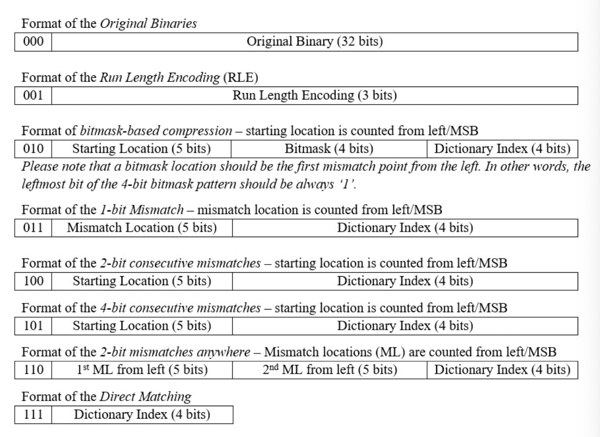

# code_compression

## Compile the code
    ``` g++ SIM.cpp -o SIM ```

## Run the code

* ### For Compression
        ``` ./SIM 1 ``` 
* ### For Decompression
        ``` ./SIM 2 ``` 

## Compression Formats Used
 * Run length encoding - RLE
 * bitmask-based encryption
 * 1-bit consecutive mismatch
 * 2-bit consecutive mismatch
 * 4-bit consecutive mismatch
 * 2-bit mismatch
 * Direct matching


 
## Input and Output Files
1. Input file for your compression function: original.txt
2. Output produced by your compression function: cout.txt
3. Input file for your decompression function: compressed.txt 
4. Output produced by your decompression function: dout.txt